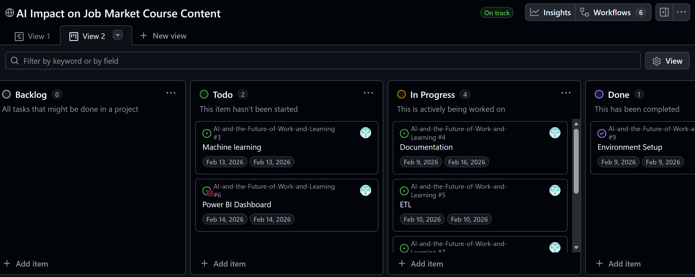
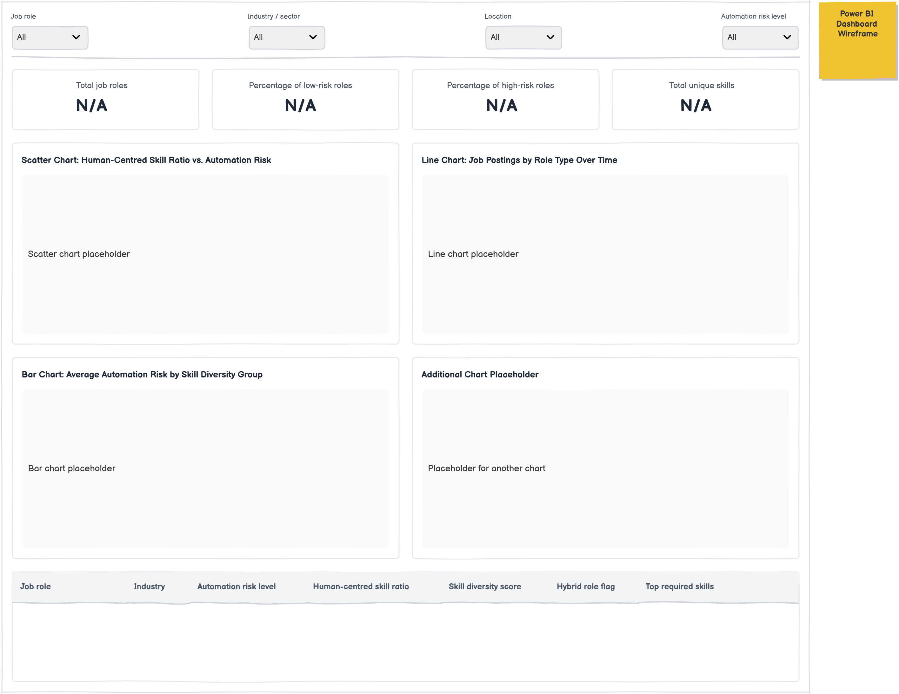
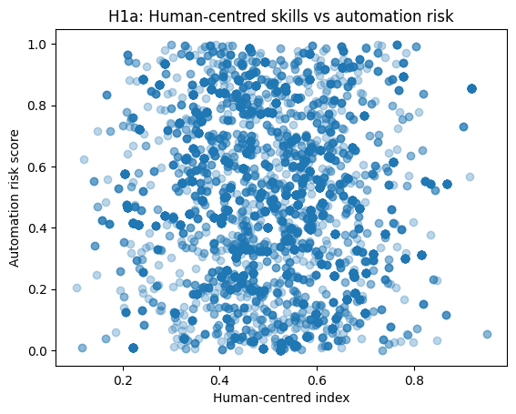
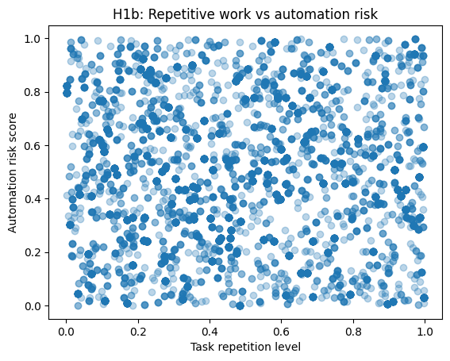
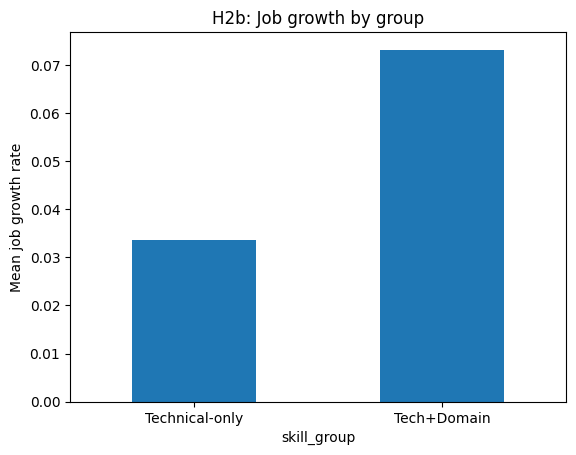

# 

# AI and the Future of Work and Learning

Educational Institutions face increasing pressure to ensure that course content remains relevant in a labour market shaped by rapid advances in artificial intelligence and automation. To make informed decisions about curriculum design, institutions require evidence-based insights into which skills and job roles are most likely to change or decline, and which are expected to remain resilient.

This project uses the datasets from kaggle to support strategic decision-making in course content development, helping Institutions align teaching programmes more closely with future workforce needs.

## Business Requirements
1. Identify Future Skill Demands
- Determine which skills are most resistant to AI-driven automation.
- Highlight emerging skill areas that should be prioritised in course curricula.

2. Assess Job Vulnerability
- Identify job roles and career pathways that are at high, medium, or low risk of automation.
- Understand which types of roles graduates may be more or less prepared for.

3. Support Curriculum Review and Design
- Identify gaps in current course offerings relative to future job-market needs.

4. Guide Student Employability Strategy
- Support decisions on employability modules, digital skills training, and transferable skills.
- Advise students on skill development aligned with future careers.

5. Ensure Ethical and Responsible Use of Data

## Project Aim & Objectives 
To support Educational Institutions in making informed curriculum decisions by analysing how artificial intelligence is changing job roles and skill requirements in the global labour market.

The project objectives are to:
1. Analyse labour-market data to identify job roles and skills most affected by AI and automation.
2. Highlight roles and skills that are likely to decline, evolve, or remain resilient.
3. Use data visualisation to communicate workforce trends relevant to higher education.
4. Apply machine-learning techniques to predict future job demand and skill changes.
5. Develop an interactive dashboard to support evidence-based curriculum design.

## Dataset Content
I’m using the AI Impact on Jobs dataset from Kaggle. 
-  1.3M LinkedIn Jobs & Skills 2024 Dataset: [View Here](https://www.kaggle.com/datasets/asaniczka/1-3m-linkedin-jobs-and-skills-2024?utm_source=chatgpt.com) 
This dataset contains over 1.3 million job adverts collected from LinkedIn and published on Kaggle.
It shows job titles and the skills employers ask for in real job postings.

In this project, this dataset is used to understand which skills are in demand, which skills are often combined together, and which new or hybrid skills are becoming more important.

- AI Automation Risk by Job Role Dataset: [View Here](https://www.kaggle.com/datasets/khushikyad001/ai-automation-risk-by-job-role?utm_source=chatgpt.com) 
This dataset, shared on Kaggle, shows how likely different job roles are to be automated.
Each job role has a score or level that tells whether the role is at low, medium or high risk from AI and automation.

In this project, this dataset is used to understand which jobs are more vulnerable and which jobs are more resilient.

## Hypothesis and how to validate?

### Hypothesis 1: Human-centred Skills and Automation Risk

Job roles that require more human-centred skills (such as communication, creativity and problem-solving) have lower automation risk than roles based mainly on routine or repetitive tasks.

H1a: More human-centred skills -> LOWER automation risk
H1b: Repetitive tasks → HIGHER automation risk

Will validate using regression statistical method

### Hypothesis 2: Digital and Domain skills

Job roles that combine digital or AI skills with domain knowledge (such as healthcare, business, education or engineering) are growing faster than roles that require only technical skills or only non-technical skills.

H2a: Tech+Domain has LOWER automation risk than Technical-only
H2b: Tech+Domain has HIGHER growth than Technical-only

Will validate using regression statistical method 

## Project Plan

#### Phase 1 - Planning 
1. Create a GitHub repository
2. Create these folders:
data/
   raw/
   processed/
notebooks/
   etl.ipynb
   hypothsis.ipynb

3. README.md - Documenting the Process 
4. Project Kanban Board - To manage the project 

#### Phase 2 - ETL 

1. Extract (load the datasets into Python - Pandas )

- Read the LinkedIn dataset
- Read the automation risk dataset
- Save as extract.py

2. Transform 

- Clean Data 
- Split the skills
- Duplictates 
- Aggregate data etc...

3. Load
- Load clean data for next phase

#### Phase 3 -Feature Engineering & EDA 
- Feature Engineering - Create viariables needed for hypothesis testing
- Descriptive Statistics 
- Correlation Matrix

#### Phase 4 – Testing Hypothesis

- Hypothesis 1: Human-centred Skills and Automation Risk
- Hypothesis 2: Hypothesis 2: Digital and Domain skills

#### Phase 4 – Build a PowerBI Dashboard

Communicate results to institutions.
1. Extract & Load Data
2. Build your visuals - Implement Wireframe

#### Phase 5 - Build the data-driven prototype (ML)

-  Build a Decision Tree Classifier

#### Phase 6 – Documentation
Final Report Must Include:

- Project Aims and Objective 
- Datasets
- ETL Process
- Hypothesis Results
- Dashboard Screenshots
- ML results
- Curriculum Recommendations

## Rationale 
#### Data Limitation
Only 14.4% of the 50,015 job postings could be matched to the automation-risk dataset. This means that all tests, models, and comparisons are based on a much smaller sample.

Because of this:
- The results may not fully represent the wider job market.
- Relationships may appear weaker than they actually are.

During the merging process, multiple job postings matched the same role. This created duplicate rows. The dataset was cleaned by removing duplicates using unique job links. This step is reported clearly to ensure transparency and accuracy.

#### Hypothesis 1 – Human-Centred Skills and Automation Risk
The analysis examined whether jobs that require higher levels of human-centred skills, such as communication and creativity, are less exposed to automation risk.

A scatter plot was used to assess the relationship between human-centred skills and automation risk, as it allows all individual data points to be visualised and helps identify whether a linear relationship exists.

For H1a (human-centred skills vs. automation risk), a slight downward trend was observed. This suggests that roles requiring higher levels of human-centred skills tend to have marginally lower automation risk. However, the relationship was extremely weak. The very low R² value (0.004) indicates that human-centred skills explain only a very small proportion of the variation in automation risk.

For H1b (task repetition vs. automation risk), the scatter plot appeared flat and widely dispersed, with no visible pattern. This supports the statistical results, which showed that task repetition does not significantly predict automation risk.

#### Hypothesis 2 – Digital and Domain Skills

The second analysis compared roles that combine technical and domain expertise (Tech+Domain) with roles that primarily require technical skills.

The comparison focused on two outcomes: automation risk and job growth. Bar charts were used to compare group averages, as they clearly display differences between categories and align with the t-test methodology applied in the statistical analysis.

For H2a (automation risk), a clear difference between the two groups was observed. Tech+Domain roles demonstrated lower average automation risk compared to technical-only roles. This visual difference aligns with the statistically significant result obtained from the hypothesis test.

For H2b (job growth), Tech + Domain roles show a higher average job growth rate than technical-only roles. However, this difference is not statistically significant (p = 0.292). Although the bar chart indicates a visual difference between the groups, the statistical test suggests that this variation may be due to chance. Therefore, there is insufficient evidence to conclude that combining technical and domain skills significantly influences projected job growth in this dataset.

#### Machine Learning Prototype
To test whether automation risk can be predicted using selected skill variables.
Instead of showing visuals, the model performance metrics (R² and RMSE) were reported.

ML results
- R^2 : 0.01
- RMSE: 0.266 

This means:
 - The model explains only a small part of the variation.
- The model is not suitable for real-world prediction.
- It is included as a proof of concept only.

## Analysis techniques used
The project used:
- Descriptive statistics
- Regression analysis
- Hypothesis testing
- A simple machine-learning prototype

Descriptive statistics were used to:
- Summarise automation risk, human-centred skills, and job growth
- Understand data distribution
- Support exploratory data analysis

To test Hypothesis 1:
- Ordinary Least Squares (OLS) regression was used

To test Hypothesis 2:
- Independent samples t-tests were used

A simple linear regression model was used as:
- A machine-learning prototype

## Ethical considerations
This project uses two publicly available Kaggle datasets: a LinkedIn job postings and skills dataset and an AI automation risk by job role dataset. Both datasets contain aggregated information about job roles and skills. They do not include personal names, contact details, or other identifying information. Therefore, there is no direct risk to individual privacy.

However, some ethical concerns remain. The LinkedIn job postings dataset includes only jobs advertised on LinkedIn and collected by the dataset authors. This creates platform bias. Jobs from organisations or regions that do not widely use LinkedIn may be underrepresented. As a result, smaller employers, informal labour markets, and roles in developing regions may not be fully represented in the data.

The automation risk and skill measures in the AI automation risk dataset are based on secondary sources or modelling assumptions rather than direct observation. These estimates may reflect the judgement of the dataset creators and may contain hidden assumptions about which jobs are more likely to be automated.

## Dashboard Design
The final dashboard differs in several respects from the original wireframe design.

#### Structural Differences
In the wireframe, four KPI cards were proposed:
- Total job postings
- Average automation risk
- Average job growth
- Average human-centred skills

In the implemented dashboard, these KPIs are displayed as:
- Average growth
- Average risk
- Average human-centred skills
- Jobs count

While the metrics are largely consistent, the wording has been simplified.

#### Slicers and Filters

The wireframe proposed automation risk band and job role as primary slicers.
In the final dashboard:
- A Skill Group slicer is included.
- A Risk Band slicer is present (High, Low, Medium).
This represents a shift from role-level filtering to skill-group-level filtering, placing greater emphasis on hypothesis testing rather than exploratory job-level analysis.

#### Visualisations
Scatter Plot (H1a)
The scatter plot remains consistent with the wireframe. It shows:
- Human-Centred Index (x-axis)
- Automation Risk Score (y-axis)
However, the implemented version contains a very high density of points, which slightly reduces interpretability compared to the cleaner conceptual layout shown in the wireframe.

Bar Charts (H2a and H2b)
The wireframe proposed two grouped comparisons:
- Automation risk by skill group
- Job growth by skill group

In the final dashboard:
- H2a (Average Automation Risk by Skill Group) is implemented.
- H2b (Average Job Growth by Skill Group) is implemented.

One comparison includes “All Other Roles” instead of strictly maintaining the original two proxy categories.
This slightly modifies the original grouping logic but maintains alignment with the research hypotheses.

Distribution Chart
The column chart showing the distribution of automation risk (Low, Medium, High) is implemented as planned. This visual provides contextual support and matches the wireframe’s descriptive intent.

Compared to the wireframe:
- The final dashboard places the title centrally (“AI and the Future of Work and Learning”), to make it more presentation-oriented.
- KPI cards are positioned prominently but use stronger colour contrasts than initially suggested.
- Visual spacing is slightly tighter, particularly around the scatter plot.

Overall:
- All core hypotheses (H1a, H2a, H2b) are represented.
- Summary metrics are displayed clearly.
- Distribution context is preserved.

However, there are three key differences:
- Filtering emphasis shifted from job-role exploration to skill-group comparison.
- Visual density (especially in the scatter plot) is higher than in the wireframe.
- The final layout is more presentation-driven, with stronger styling choices.

Overall, the dashboard successfully translates the wireframe into a functional and visually coherent analytical tool, with minor structural and stylistic deviations.

 'The published dashboard can be found here: [View Here](https://app.powerbi.com/links/YAjlzsqQEM?ctid=c233c072-135b-431d-af59-35e05babf941&pbi_source=linkShare) 

## Development roadmap
The project followed an iterative development process that was shaped by technical limitations and data quality issues.

An early technical problem occurred when attempting to commit the full LinkedIn job postings dataset, which contained over one million records. Due to repository size and storage limits, the repository had to be recreated after several failed commit attempts. To solve this problem, the dataset was reduced to approximately 50,000 job postings before analysis began.

This smaller dataset allowed for stable version control and faster local processing, but it also affected later stages of analysis. In particular, reducing the dataset limited the number of job postings that could be matched with the automation risk dataset. This weakened the statistical reliability of the hypothesis testing. As a result, parts of the analytical approach were adjusted, including the grouping method used in Hypothesis 2.

The development process moved through several stages: setting up the repository and importing the data, identifying storage and version control limitations, reducing the dataset, cleaning and matching the data, carrying out feature engineering and hypothesis testing, developing and refining the dashboard, and completing documentation.

Overall, this roadmap demonstrates the need to balance practical computing limitations with careful and rigorous analysis throughout the project.

## Main data analysis libraries
Python Libraries Used:
- Pandas: Data loading, cleaning, merging and feature engineering.
- NumPy: Used to support numerical operations and missing value handling.
- SciPy: To conduct statistical hypothesis testing.
- Statsmodels: Used to estimate linear regression models for Hypothesis.
- Scikit-learn: Used to build a simple predictive prototype model.

## Credits & Content
The datasets used in this project were obtained from Kaggle:
- LinkedIn Jobs and Skills Dataset (2024), Kaggle
- AI Automation Risk by Job Role Dataset, Kaggle

Generative AI tools (ChatGPT, Github Chat) were used for:
- Ideas and brainstorming
- Support in data analysis workflow coding to achieve the desired results
- EDA & hypothesthis testing choices and explanations. 

## Media
No external images, photographs or multimedia assets were used in this project.
Dashboard wireframe - created using balsamiq
Kanband snapshot - Github Kanban board 
Dashboard Snapshot - PowerBI Dashboard 

## Acknowledgements 
I would like to express my gratitude to my facilitator and cohorts for support throughout this project.